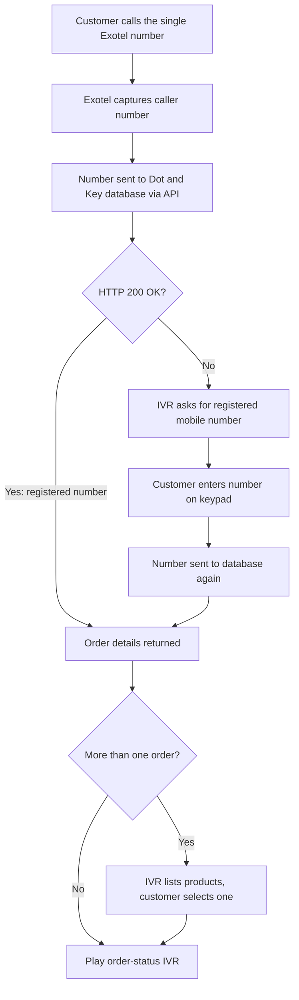

# Dot & Key: Order Status IVR on a Single Number

| | |
|---|---|
| **Client** | Dot & Key |
| **Industry** | Beauty & Cosmetics / D2C e-commerce (India) |
| **Solution** | Exotel IVR integrated with the client's order database through an API |
| **Channel** | Voice: inbound IVR and order-confirmation call |
| **My role** | Sales Engineer: solution design, integration proposal and coordination |

## Problem
Dot & Key wanted customers to know how soon their product would reach the doorstep, and whether it was packed, shipped or out for delivery. This had to happen **over a phone call**, not through the app or website.

The client's requirements:
- Call the customer when an order is booked, confirm the product ordered, and invite them to call back for status
- Promote **one single number** on the website for all status queries
- Recognize customers calling from their **registered mobile number** and play their order status
- Ask for the registered number on the keypad when a customer calls from a **different number**
- Let customers with **multiple orders** choose which order to hear about

## Solution
I proposed an **Exotel IVR on a single number**, integrated with Dot & Key's order database through an API. Because the number is an Exotel asset, Exotel captures the caller's number on every call and sends it to the client's system.

- If the number is registered, the client's system replies **HTTP 200 OK** with the order details, and Exotel plays the matching status IVR.
- If the client's system does not return 200 OK, Exotel plays another IVR that asks for the **registered mobile number** on the keypad, sends it to the client's system again, and plays the status returned.
- If the customer has **more than one order**, the IVR lists the products by name and plays the status of the one the customer selects.

Example status messages: *order received and saved*, *order out for delivery*, *order will be dispatched within 2 days*.

## Workflow

## My contribution
- Understood the client's customer-communication challenge and turned it into an IVR and API workflow
- Designed the call flow: caller recognition, the 200 OK check, keypad fallback and the multi-order menu
- Proposed the Exotel API integration with the client's database
- Coordinated requirements between the client's technical team and Exotel's team

## Business value
Customers can find out their order and delivery status by calling one number, without the app or website. Routine order-status queries are handled automatically, and the client gets a simple, voice-based post-purchase experience for its customers.
