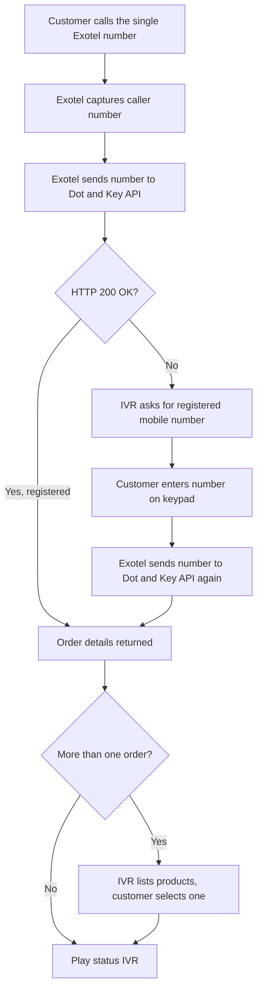
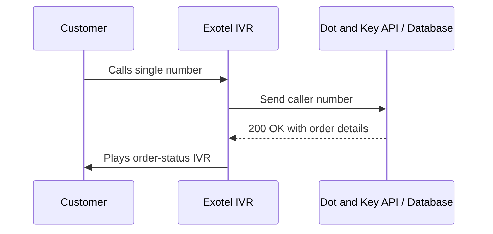
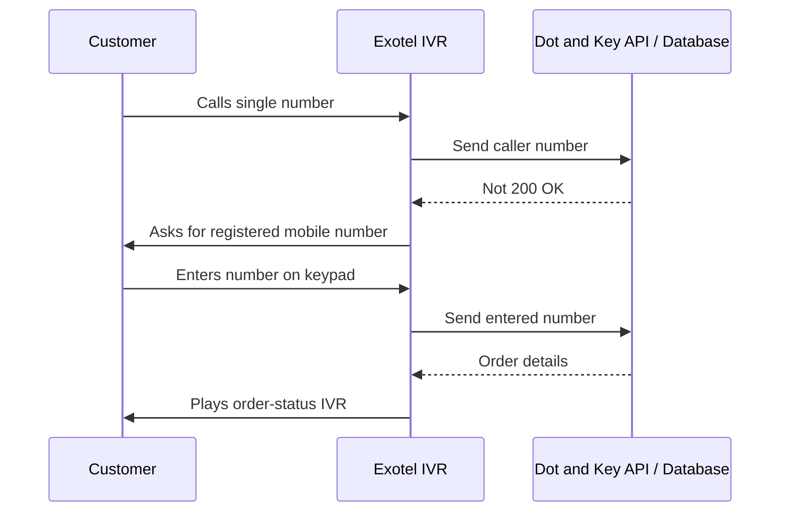

# Solution Architecture

## High-level flow

## Sequence: registered number

## Sequence: different number

## Components
| Component | Owner | Role |
|---|---|---|
| Website | Client | Promotes the single number |
| Exotel number and IVR | Exotel | Receives calls, runs the call flow, plays messages |
| Order database / API | Client | Looks up orders by mobile number, returns status |
| Order-confirmation call | Exotel + Client | Outbound call after the order is booked |

## Design notes
- **Number as the key:** the mobile number identifies the customer and their orders
- **HTTP status drives the flow:** 200 OK continues, otherwise the keypad fallback starts
- **Always live data:** status comes from the client's system at the time of the call

## Diagram files
_Add the original draw.io / PNG architecture diagram here if one exists._
