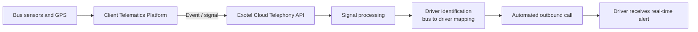
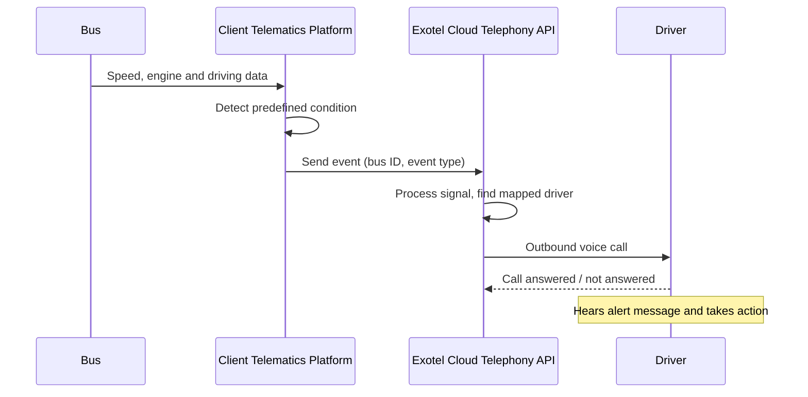

# Solution Architecture

## High-level flow

## Sequence

## Components
| Component | Owner | Role |
|---|---|---|
| Vehicle sensors / GPS | Client | Capture speed, engine and driving data |
| Telematics platform | Client | Monitor the vehicle and generate signals |
| Exotel Cloud Telephony API | Exotel | Receive signals and place outbound calls |
| Bus-to-driver mapping | Client / Exotel | Identify who to call for each bus |
| Voice alert content | Client / Exotel | Message played to the driver per event type |

## Design notes
- **Event-driven:** no polling, an alert is raised only when a condition is met
- **Loosely coupled:** the telematics platform only needs to send an event to the API
- **Extensible:** new signals can be added by defining a new event and message

## Diagram files
_Add the original draw.io / PNG architecture diagram here if one exists._
