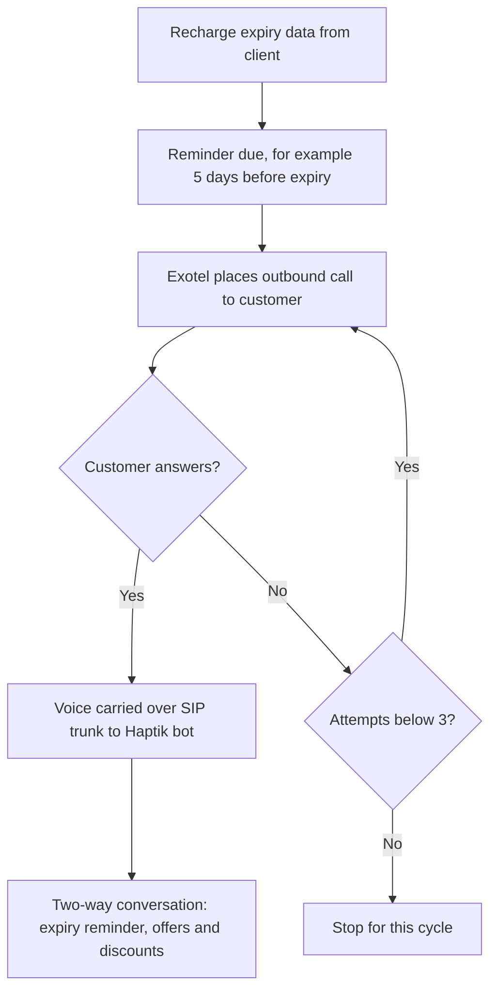
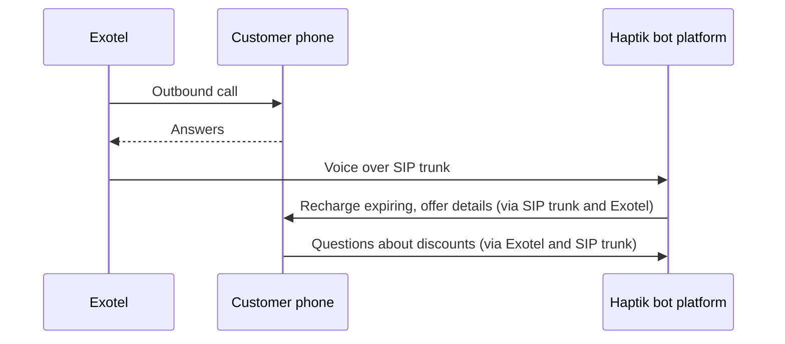
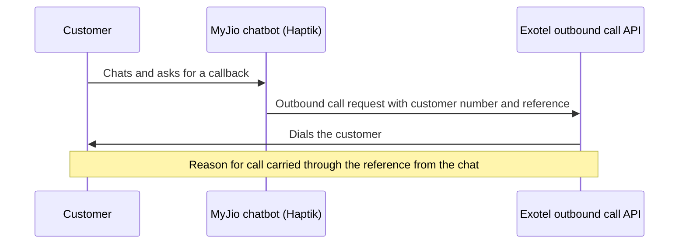

# Solution Architecture

## Flow 1: Recharge reminder (outbound, two-way voicebot)

## Sequence: reminder call

## Flow 2: Chat-to-callback (Jio Fiber)

## Components
| Component | Owner | Role |
|---|---|---|
| Recharge data and customer list | Client (Jio / Haptik) | Decides who to call and when |
| Haptik chatbot and voicebot | Haptik | Holds the conversation |
| Exotel SIP trunk | Exotel | Carries two-way voice between the bot and the customer |
| Exotel outbound call API | Exotel | Places calls to customers, including chat-triggered callbacks |
| Customer phone / MyJio chat | Customer | Receives calls, starts chat |

## Design notes
- **SIP trunk over streaming:** lower cost and latency at very large scale
- **Two-way voice:** the customer can speak to the bot, not just listen
- **API-triggered callbacks:** a chat can turn into a call without agent involvement
- **Same design for SIM and Fiber:** one platform, two customer types

## Diagram files
_Add the original draw.io / PNG architecture diagram here if one exists._
