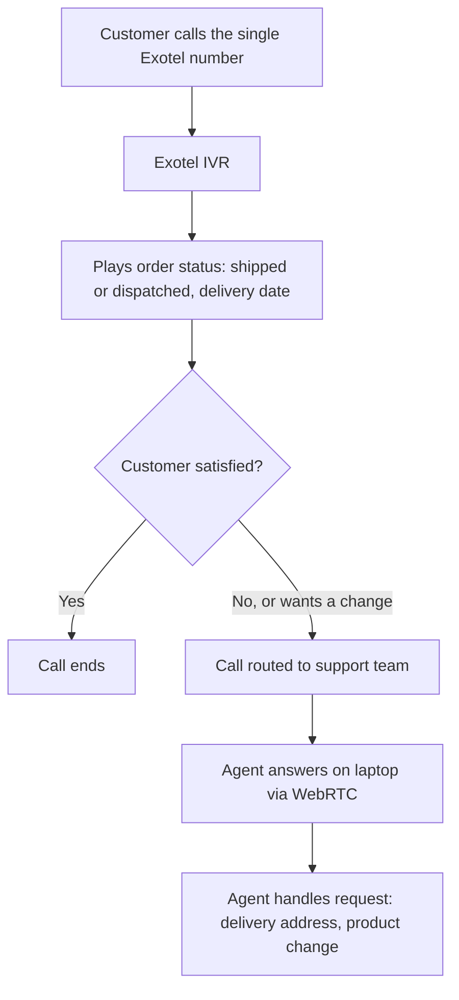
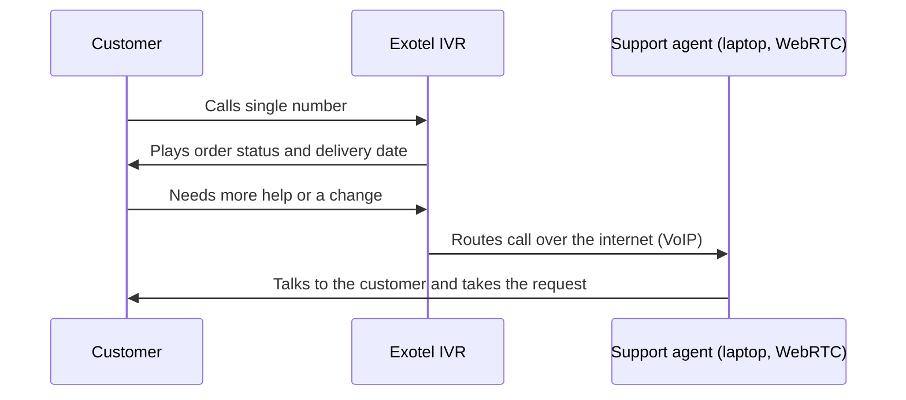

# Solution Architecture

## High-level flow

## Sequence

## Components
| Component | Owner | Role |
|---|---|---|
| Website | Client | Promotes the single number |
| Exotel number and IVR | Exotel | Receives calls, plays order status, offers agent handover |
| Order information | Client | Source of status and delivery date |
| WebRTC calling | Exotel | Delivers calls to agents' browsers over the internet |
| Support team laptops | Client | Where agents answer calls |

## Design notes
- **IVR first:** routine queries are answered automatically
- **Human fallback:** customers can always reach a person
- **Browser-based agent calling:** agents use laptops and headsets, no mobile phones
- **Internet-based voice (VoIP):** call quality depends on the agent's internet connection

## Diagram files
_Add the original draw.io / PNG architecture diagram here if one exists._
